# 포토웍스 웹 사용법

사진 여러 장을 한 번에 **크기 조정**하고, **서명**과 **촬영 정보(EXIF)** 를 얹고, 간단한 **보정**까지 해서
사진마다 개별 파일로 저장하는 브라우저 프로그램입니다. 

맥에서는 없었던 photoWORKS를 어디서나 사용 할 수 있도록 웹으로 새롭게 개발한 것입니다.

(원작자님께 감사의 말씀 드립니다. https://cafe.naver.com/photoworks2)

- 사진은 서버로 올라가지 않습니다. 모든 처리는 내 컴퓨터의 브라우저 안에서만 이루어집니다.
- 설치 없이 주소로 바로 쓰거나, 앱처럼 설치해서 인터넷 없이도 쓸 수 있습니다.
- 권장 브라우저: **Chrome** 또는 **Edge** (폴더에 바로 저장, 내 컴퓨터 글꼴 불러오기 지원). Whale·Safari·Firefox도 동작합니다.

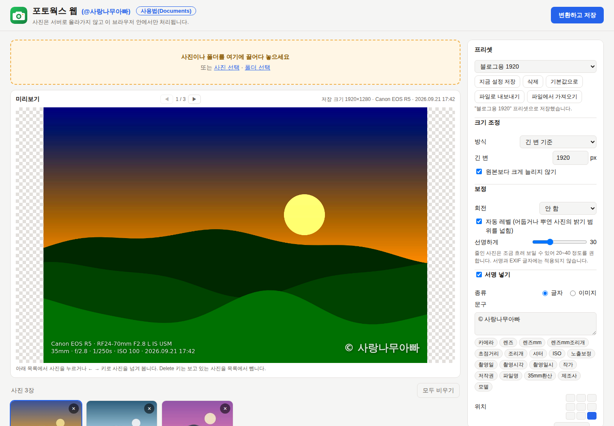

## 목차

1. [시작하기](#1-시작하기)
2. [화면 구성](#2-화면-구성)
3. [사진 넣기와 미리보기](#3-사진-넣기와-미리보기)
4. [설정 항목 자세히](#4-설정-항목-자세히)
   - [프리셋](#41-프리셋) · [크기 조정](#42-크기-조정) · [보정](#43-보정) · [서명 넣기](#44-서명-넣기)
   - [사진 정보(EXIF) 넣기](#45-사진-정보exif-넣기) · [저장 형식](#46-저장-형식) · [파일 이름](#47-파일-이름) · [저장 위치](#48-저장-위치)
5. [변환하고 저장하기](#5-변환하고-저장하기)
6. [단축키](#6-단축키)
7. [후원하기](#7-후원하기)
8. [앱으로 설치하기](#8-앱으로-설치하기)
9. [자주 묻는 질문과 한계](#9-자주-묻는-질문과-한계)
10. [개발자용 정보](#10-개발자용-정보)

---

## 1. 시작하기

### 인터넷 주소로 쓰기

**https://hupers77.github.io/ProjPhotoChanges/** 를 Chrome에서 엽니다.

> - 이 주소는 저장소 주인이 GitHub에서 한 번 켜 두어야 열립니다. 
> - GitHub Server에서 가동되며, 작동이 안되는 경우 저에게 문의 주세요. 
> - main에 올라가는 변경은 자동으로 반영되어 최신 버전으로 사용 할 수 있습니다.

### 내 맥에서 직접 실행하기

> git, python 3.10 이상 버전의 설치가 되어 있어야 합니다.

처음 한 번 저장소를 받습니다.

```
cd ~
git clone https://github.com/hupers77/ProjPhotoChanges.git projphotochanges
cd projphotochanges
```

이후에는 이 폴더에서 아래를 실행하고 Chrome으로 http://localhost:8000 을 엽니다. 최신 코드는 `git pull`로 받습니다.

```
python3 -m http.server 8000
```

(주의사항) `index.html`을 더블클릭(file://)해서는 열리지 않습니다. 꼭 위처럼 주소로 여세요.

---

## 2. 화면 구성

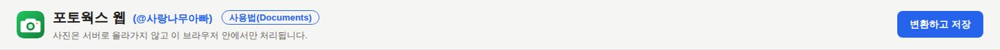

| 위치 | 내용 |
|---|---|
| 상단 제목 줄 | 앱 이름, 만든 이 블로그 링크 **(@사랑나무아빠)**, 이 사용법을 새 창으로 여는 **사용법(Documents)**, 오른쪽에 **♥ 후원하기** 와 **변환하고 저장** 버튼. 스크롤해도 항상 위에 고정되어 있어 언제든 바로 누를 수 있습니다. 변환 중에는 진행 장수와 **중지** 버튼이 함께 보이고, 설치할 수 있는 브라우저에서는 **앱으로 설치** 버튼도 나타납니다. |
| 왼쪽 | 사진 넣는 상자(주황색), 미리보기, 넣은 사진 목록 |
| 오른쪽 | 모든 설정. 위에서부터 프리셋 → 크기 조정 → 보정 → 서명 → 사진 정보 → 저장 형식 → 파일 이름 → 저장 위치 → 변환 버튼 |

설정은 바꾸는 즉시 이 브라우저에 기억되어, 다음에 열어도 그대로 남아 있습니다.

---

## 3. 사진 넣기와 미리보기

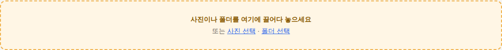

- 사진 파일이나 **폴더째** 주황색 상자(또는 화면 아무 곳)에 끌어다 놓습니다. 하위 폴더 안의 사진까지 모두 들어갑니다.
- **사진 선택** 으로 여러 장을 고르거나, **폴더 선택** 으로 폴더를 통째로 고를 수 있습니다.
- 지원 형식: JPEG, PNG, WebP, GIF, BMP, AVIF, TIFF(브라우저가 여는 경우), HEIC(Safari에서만).
- 사진은 파일 이름 순서(숫자는 크기 순: 2 → 10)로 정렬되어 들어갑니다.

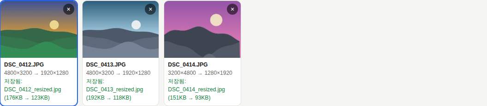

목록의 각 사진 카드에는 원본 크기 → 저장될 크기가 표시됩니다. 오른쪽 위 **×** 로 그 사진만 뺄 수 있고,
**모두 비우기** 로 목록을 비웁니다.

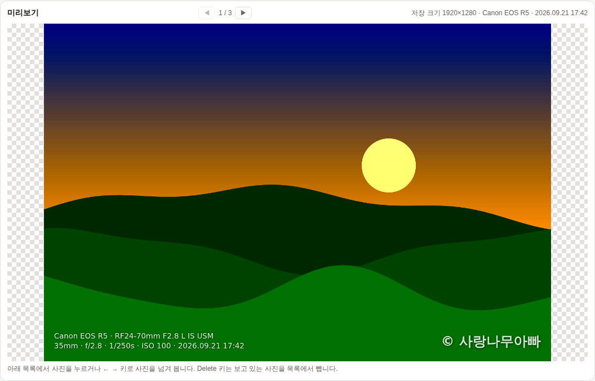

- 미리보기는 **저장될 모습 그대로**(크기, 회전, 보정, 서명, EXIF 글자)를 보여 주고, 설정을 바꾸면 바로 바뀝니다.
- 목록에서 사진을 누르거나, **◀ ▶** 버튼 또는 키보드 **← →** 로 다른 사진을 봅니다. 가운데 숫자는 몇 번째 사진인지입니다.
- 오른쪽 위에 저장 크기, 카메라, 촬영일시가 보입니다. 촬영 정보가 없는 사진은 "EXIF 없음"으로 표시됩니다.

---

## 4. 설정 항목 자세히

### 4.1 프리셋

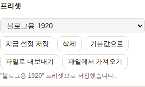

자주 쓰는 설정 묶음을 이름 붙여 저장해 두고 한 번에 불러오는 기능입니다.
프리셋에는 **아래 4.2~4.8의 모든 설정**과 **서명 이미지**가 함께 저장됩니다.
(예: "블로그용 1920", "인쇄용 300dpi", "인스타 1080 정사각")

| 항목 | 기능 |
|---|---|
| 간단히 보기 / 설명 보기 | 오른쪽 위 버튼. 설정 칸의 설명 문구를 숨기고 줄 간격을 좁혀 설정 전체 길이를 약 1/4 줄입니다. 한 번 더 누르면 설명이 다시 보입니다. 선택한 상태는 기억됩니다. (경고 문구는 숨기지 않습니다.) |
| 프리셋 목록 | 저장된 프리셋을 고르면 그 설정이 **즉시 적용**됩니다. 서명 이미지가 들어 있는 프리셋이면 서명 이미지도 바뀝니다. |
| 지금 설정 저장 | 지금 화면의 설정을 프리셋으로 저장합니다. 이름을 묻고, 같은 이름이 있으면 덮어쓸지 확인합니다. 서명 종류가 "이미지"일 때만 서명 이미지를 같이 저장합니다. |
| 삭제 | 목록에서 고른 프리셋을 지웁니다. 지금 화면의 설정은 그대로 둡니다. |
| 기본값으로 | 모든 설정을 처음 상태로 되돌립니다. 저장된 프리셋은 지워지지 않습니다. |
| 파일로 내보내기 | 저장된 프리셋 전체를 `photoworks-presets.json` 파일로 내려받습니다. 백업용, 또는 다른 컴퓨터·브라우저로 옮길 때 씁니다. |
| 파일에서 가져오기 | 내보낸 프리셋 파일을 읽어 목록에 추가합니다. 같은 이름의 프리셋은 파일 쪽으로 바뀝니다. |

> **주의:** 브라우저는 주소마다 저장 공간이 따로입니다. `localhost:8000`에서 만든 프리셋은 GitHub Pages 주소에 보이지 않으니,
> **파일로 내보내기 → 다른 주소에서 파일에서 가져오기** 로 옮기세요. 서명 이미지가 아주 크면 저장 공간이 모자라
> 이미지 없이 설정만 저장될 수 있고, 그때는 알림이 뜹니다.

### 4.2 크기 조정

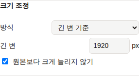

| 방식 | 설명 |
|---|---|
| 긴 변 기준 | 가로·세로 중 긴 쪽을 지정한 px로 맞춥니다. 가로 사진과 세로 사진이 섞여 있을 때 가장 무난합니다. (기본 1920) |
| 짧은 변 기준 | 짧은 쪽을 지정한 px로 맞춥니다. |
| 가로 기준 / 세로 기준 | 가로(또는 세로)를 지정한 px로 맞추고 나머지는 비율대로 바뀝니다. |
| 가로×세로 안에 맞추기 | 지정한 상자 안에 들어가도록 비율을 유지하며 줄입니다. 잘라내지는 않습니다. |
| 비율(%) | 원본 대비 비율로 줄이거나 늘립니다. |
| 원본 크기 유지 | 크기는 그대로 두고 서명·보정·형식 변환만 합니다. |
| 원본보다 크게 늘리지 않기 | 켜 두면 원본이 지정 크기보다 작을 때 늘리지 않고 원본 크기로 둡니다. |

크기를 줄일 때는 여러 단계로 나눠 줄여서 계단 현상 없이 깨끗하게 만듭니다.
사진의 방향 정보(세로로 찍은 사진)는 자동으로 바로 세워서 저장합니다.

### 4.3 보정

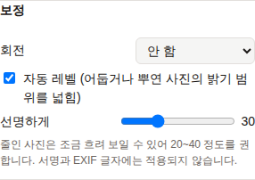

| 항목 | 설명 |
|---|---|
| 회전 | 모든 사진을 오른쪽으로 90°, 180°, 왼쪽으로 90° 돌립니다. 크기 조정은 돌린 뒤의 가로·세로를 기준으로 합니다. (사진 방향 정보에 따른 자동 세우기는 이와 별개로 항상 적용됩니다.) |
| 자동 레벨 | 사진에서 가장 어두운 곳과 가장 밝은 곳을 찾아 밝기 범위를 끝까지 넓힙니다. 뿌옇거나 어둡게 나온 사진이 또렷해집니다. 색 균형은 바꾸지 않습니다. 이미 밝기 범위가 꽉 찬 사진에는 변화가 없습니다. |
| 선명하게 | 0(끔)~100. 사진을 줄이면 조금 흐려 보이는데, 이를 또렷하게 만듭니다(언샵 마스크). 20~40 정도를 권합니다. 너무 높이면 윤곽에 테가 생깁니다. |

보정은 크기 조정 뒤에 적용되고, 서명과 EXIF 글자에는 적용되지 않습니다.

### 4.4 서명 넣기

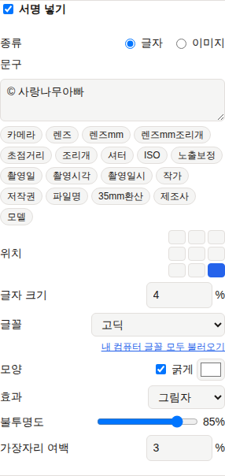

**서명 넣기** 를 켜면 설정이 펼쳐집니다.

| 항목 | 설명 |
|---|---|
| 종류 | **글자** 또는 **이미지**. |
| 문구 (글자) | 서명으로 넣을 글. 여러 줄 가능. 아래 토큰 버튼을 누르면 `{작가}`처럼 사진마다 바뀌는 값을 넣을 수 있습니다. (예: `© {작가}`) |
| 이미지 고르기 (이미지) | 로고나 서명 그림 파일을 고릅니다. 배경이 투명한 PNG가 가장 잘 어울립니다. 고른 이미지는 브라우저에 기억됩니다. **지우기** 로 뺍니다. |
| 너비 (이미지) | 서명 이미지의 너비를 사진 가로 대비 %로 정합니다. |
| 위치 | 9칸 중 하나를 누릅니다(위·가운데·아래 × 왼쪽·가운데·오른쪽). EXIF 글자와 같은 위치를 고르면 겹치지 않고 위아래로 쌓입니다. |
| 글자 크기 | 사진의 **짧은 변 대비 %**. 사진 크기가 달라도 같은 비율로 찍힙니다. 글이 너무 길면 사진 밖으로 넘치지 않게 자동으로 줄어듭니다. |
| 글꼴 | **기본**(고딕·명조·고정폭), **자주 쓰는 글꼴**(이 컴퓨터에 설치된 것 중 맥·윈도우의 대표 글꼴과 나눔·애플 한글 글꼴 등을 자동으로 찾아 보여 줌), **내 컴퓨터 글꼴**(아래 링크로 불러온 전체 글꼴). |
| 내 컴퓨터 글꼴 모두 불러오기 | Chrome·Edge에서 보입니다. 누르면 브라우저가 글꼴 접근 권한을 묻고, 허용하면 컴퓨터에 설치된 **모든 글꼴**이 목록에 추가됩니다. 한 번 허용하면 다음부터는 자동으로 불러옵니다. |
| 모양 | **굵게**, 글자 색. |
| 효과 | 없음 / **그림자** / **테두리** / **배경 상자**. 사진 위에서 글이 잘 읽히게 해 줍니다. 그림자·테두리·상자 색은 글자 색이 밝으면 어둡게, 어두우면 밝게 자동으로 정해집니다. |
| 불투명도 | 10~100%. 낮출수록 사진이 비쳐 보이는 은은한 워터마크가 됩니다. |
| 가장자리 여백 | 사진 가장자리에서 떨어진 거리. 짧은 변 대비 %. |

> 다른 컴퓨터에서 만든 프리셋에 이 컴퓨터에 없는 글꼴이 들어 있으면 "저장된 설정의 글꼴"로 표시되고, 비슷한 기본 고딕으로 대신 그려집니다.

### 4.5 사진 정보(EXIF) 넣기

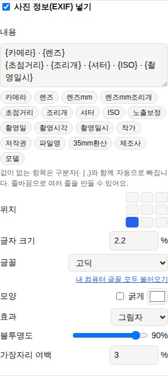

카메라에 기록된 촬영 정보를 사진 위에 글로 넣습니다. 위치·크기·글꼴·효과 등 모양 설정은 서명과 같습니다.

**내용** 칸에 토큰을 넣으면 사진마다 그 값으로 바뀝니다. 토큰 버튼을 누르면 커서 자리에 들어갑니다.

| 토큰 | 예시 값 | 설명 |
|---|---|---|
| `{카메라}` | Canon EOS R5 | 제조사 + 모델 (중복 없이) |
| `{제조사}` / `{모델}` | Canon / Canon EOS R5 | 따로 쓰고 싶을 때 |
| `{렌즈}` | RF24-70mm F2.8 L IS USM | 렌즈 전체 이름 |
| `{렌즈mm}` | 24-70mm | 렌즈 초점거리 범위만 짧게 |
| `{렌즈mm조리개}` | 24-70mm f/2.8 | 초점거리 범위 + 최대 개방 조리개 |
| `{초점거리}` | 35mm | 촬영 당시 초점거리 |
| `{35mm환산}` | 52mm | 35mm 환산 초점거리 (카메라가 기록한 경우) |
| `{조리개}` | f/2.8 | |
| `{셔터}` | 1/250s | |
| `{ISO}` | ISO 100 | |
| `{노출보정}` | +0.7EV | 0이면 비어 있음 |
| `{촬영일}` / `{촬영시각}` / `{촬영일시}` | 2026.09.21 / 17:42 / 2026.09.21 17:42 | |
| `{작가}` / `{저작권}` | 사랑나무아빠 | 카메라에 입력해 둔 경우 |
| `{파일명}` | DSC_0412 | 확장자 뺀 원본 파일 이름 |

- 값이 없는 항목은 앞의 구분자(`·` `|` `,` ` / `)와 함께 **자동으로 빠집니다**. 예를 들어 렌즈 정보가 없는 사진은
  `{카메라} · {렌즈}` 가 그냥 "Canon EOS R5"가 됩니다.
- 줄을 바꾸면 여러 줄로 찍힙니다.
- EXIF는 JPEG 원본에서 읽습니다.

### 4.6 저장 형식

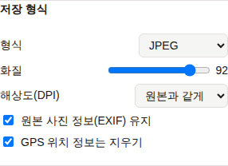

| 항목 | 설명 |
|---|---|
| 형식 | **원본과 같게**(JPEG·PNG·WebP는 그대로, 그 밖은 JPEG), **JPEG**, **PNG**, **WebP**, **아이콘(ICO)**. 투명한 PNG를 JPEG로 저장하면 투명한 곳은 흰색이 됩니다. 아이콘은 아래 설명을 보세요. |
| 화질 | 50~100. JPEG·WebP에만 쓰입니다. 92 정도면 눈으로 원본과 구분하기 어렵고 용량은 크게 줄어듭니다. |
| 해상도(DPI) | 파일에 기록할 인쇄 해상도. **원본과 같게**는 원본에 적힌 값을 그대로 씁니다. 화면용은 72, 인화·인쇄용은 300을 고르세요. 픽셀 수(크기)는 바뀌지 않고, 인쇄할 때 몇 cm로 나올지만 정해집니다. JPEG·PNG에 기록되며 WebP는 DPI를 담지 않습니다. |
| 원본 사진 정보(EXIF) 유지 | 켜 두면 원본의 촬영 정보를 결과 파일(JPEG)에 그대로 남깁니다. 방향은 바로 세운 값으로, 픽셀 크기는 새 크기로 고치고, 오래된 미리보기 썸네일은 뺍니다. |
| GPS 위치 정보는 지우기 | EXIF를 남길 때 촬영 위치(GPS)만 지웁니다. 블로그나 SNS에 올릴 사진이라면 켜 두기를 권합니다. (기본 켜짐) |

**아이콘(ICO) 형식**

- 사진 가운데를 정사각형으로 잘라 **32×32와 16×16 두 크기를 함께 담은 `.ico` 파일 하나**를 사진마다 만듭니다.
  (웹사이트 파비콘, Windows 폴더·바로가기 아이콘에 그대로 쓸 수 있습니다.)
- 이 형식을 고르면 **크기 조정·보정·서명·사진 정보 넣기·화질·DPI·EXIF 설정은 모두 쓰지 않고** 아이콘 변환만 합니다.
  설정 값은 지워지지 않으니 다른 형식으로 돌아가면 그대로 다시 적용됩니다.
- 파일 이름 규칙은 그대로 쓰이고 확장자만 `.ico`가 됩니다.
- 미리보기에는 32px 아이콘을 크게 확대해 실제 픽셀 그대로 보여 줍니다.

### 4.7 파일 이름

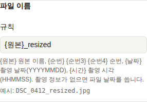

**규칙** 에 아래 토큰을 섞어 저장할 파일 이름을 만듭니다. 확장자는 형식에 맞게 자동으로 붙습니다. 아래에 예시가 바로 보입니다.

| 토큰 | 예시 | 설명 |
|---|---|---|
| `{원본}` | DSC_0412 | 원본 파일 이름 |
| `{순번}` `{순번3}` `{순번4}` | 01 / 001 / 0001 | 목록 순서 번호(2·3·4자리) |
| `{날짜}` | 20260921 | 촬영 날짜. 촬영 정보가 없으면 파일 날짜 |
| `{시간}` | 174210 | 촬영 시각 |

예: `{날짜}-{원본}` → `20260921-DSC_0412.jpg`, `여행_{순번3}` → `여행_001.jpg`

### 4.8 저장 위치

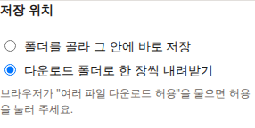

| 항목 | 설명 |
|---|---|
| 폴더를 골라 그 안에 바로 저장 | Chrome·Edge 전용. 변환을 시작할 때 저장할 폴더를 한 번 고르면 모든 사진이 그 안에 개별 파일로 저장됩니다. 같은 이름의 파일이 있으면 **덮어쓰지 않고** ` (1)`, ` (2)` 를 붙입니다. |
| 다운로드 폴더로 한 장씩 내려받기 | 모든 브라우저. 사진이 다운로드 폴더에 한 장씩 저장됩니다. 처음에 브라우저가 "여러 파일 다운로드 허용"을 물으면 **허용**을 누르세요. |

결과는 사진마다 개별 파일로 저장됩니다.

---

## 5. 변환하고 저장하기

상단 오른쪽(또는 설정 맨 아래)의 **변환하고 저장** 을 누릅니다. 단축키는 **⌘+Enter**(윈도우는 Ctrl+Enter)입니다.

- 컴퓨터의 CPU 코어 수에 맞춰 **여러 장(최대 4장)을 동시에** 백그라운드에서 변환합니다. 처리 중에도 화면이 멈추지 않습니다.
  설정 아래의 안내 문구에 동시에 처리하는 장수가 표시됩니다.
- 저장은 목록 순서대로 한 장씩 합니다.
- 각 사진 카드에 진행 상태와 결과(저장된 파일 이름, 원본 용량 → 결과 용량)가 표시됩니다.
- **중지**(또는 Esc)를 누르면 지금 처리 중인 사진까지만 저장하고 멈춥니다.

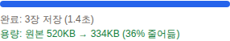

끝나면 저장한 장수, 걸린 시간, **전체 용량이 원본보다 얼마나 줄었는지**가 표시됩니다.

결과 예시 (긴 변 1920, 자동 레벨, 선명하게 30, 서명 오른쪽 아래, EXIF 왼쪽 아래):

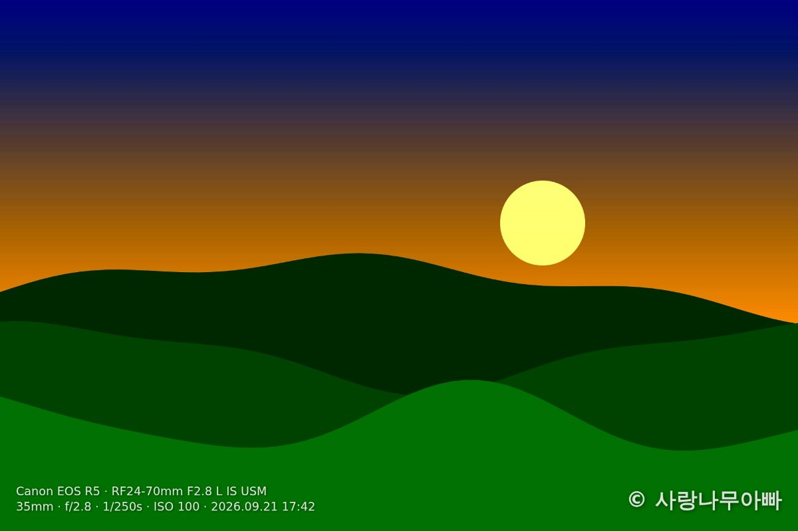

---

## 6. 단축키

| 키 | 동작 |
|---|---|
| ⌘+Enter / Ctrl+Enter | 변환하고 저장 |
| Esc | 변환 중지 |
| ← / → | 미리보기에서 이전 / 다음 사진 |
| Delete / Backspace | 미리보기 중인 사진을 목록에서 빼기 |

글자 입력칸에 커서가 있을 때는 ← → Delete가 글자 편집에 쓰입니다. 빈 곳을 한 번 누른 뒤 쓰세요.

---

## 7. 후원하기

상단 제목 줄의 **♥ 후원하기** 를 누르면 후원 창이 열립니다.


- **카카오페이 (5,000원)**: 컴퓨터에서는 QR 코드가 크게 보입니다. 휴대폰 카메라로 QR 코드를 찍으면 카카오페이 송금 화면이 열립니다.
  카카오페이 송금 링크는 휴대폰에서만 열리므로, 컴퓨터에서는 **주소 복사**(공유 기능이 있는 브라우저는 **공유**)로 주소를 휴대폰에 보내 열 수 있습니다.
  휴대폰에서 열면 **카카오페이로 5,000원 송금하기** 버튼이 보여 바로 송금할 수 있습니다.
- **GitHub Sponsors**: 해외 후원자용입니다. 지금은 승인 대기 중이라 "준비 중"으로 표시됩니다.

## 8. 앱으로 설치하기

설치하면 Dock(작업 표시줄)에 아이콘이 생기고 별도 창으로 열리며, **인터넷이 없어도** 실행됩니다.

- **Chrome·Edge**: 상단의 **앱으로 설치** 버튼을 누르거나, 주소창 오른쪽의 설치 아이콘을 누릅니다.
- **Safari (macOS Sonoma 이상)**: 메뉴 **파일 → Dock에 추가**.

설치한 앱도 인터넷에 연결되어 있으면 열 때마다 최신 버전을 받아 옵니다.

---

## 9. 자주 묻는 질문과 한계

- **사진이 서버로 올라가나요?** 아니요. 모든 처리는 브라우저 안에서만 합니다. 인터넷 주소로 열어도 마찬가지입니다.
- **프리셋이 갑자기 사라졌어요.** 접속한 브라우저가 다르거나, 브라우저 캐쉬를 삭제하면 프리셋 설정 내용이 기본값으로 보입니다. 파일 내보내기 하여 별도 관리해 주세요.
- **원본 파일이 바뀌나요?** 아니요. 원본은 읽기만 하고 결과는 새 파일로 저장합니다.
- **EXIF 글자가 안 찍혀요.** EXIF는 JPEG 원본에서만 읽습니다. 미리보기 오른쪽 위에 "EXIF 없음"이 보이면 그 사진에 촬영 정보가 없는 것입니다.
- **EXIF 유지를 켰는데 결과에 정보가 없어요.** EXIF는 JPEG로 저장할 때만 남습니다(PNG·WebP는 빠짐).
- **HEIC 사진이 안 열려요.** Chrome은 HEIC를 지원하지 않습니다. Safari에서 쓰거나 JPEG로 바꿔서 넣으세요.
- **색이 조금 달라 보여요.** 색 프로필(ICC)은 옮기지 않고 sRGB 기준으로 저장합니다. Adobe RGB 원본은 약간 달라 보일 수 있습니다.
- **내 컴퓨터 글꼴 불러오기가 안 보여요.** Chrome·Edge에서만 지원합니다. Safari에서는 "자주 쓰는 글꼴" 목록을 쓰세요.
- **아주 큰 사진을 수백 장 넣어도 되나요?** 네, 됩니다. 한 번에 최대 4장씩만 메모리에 올려 처리합니다.
- **기능 제안을 하고 싶어요** 네, 제 블로그에 댓글로 작성하여 주시면, 적극 검토하겠습니다.

---

## 10. 개발자용 정보

빌드 과정 없이 정적 파일(ES 모듈)만으로 동작합니다. 라이선스: GPL-3.0.

| 파일 | 역할 |
|---|---|
| `index.html`, `css/style.css` | 화면 |
| `js/main.js` | 화면 연결, 목록, 미리보기, 단축키, 일괄 실행 |
| `js/settings.js` | 모든 설정을 담는 객체, 기본값, 저장/불러오기 |
| `js/presets.js` | 프리셋 저장/삭제, 파일 내보내기/가져오기 |
| `js/pipeline.js` | 사진 1장 처리: 디코드 → 리사이즈 → 회전 → 보정 → 오버레이 → 인코딩 → EXIF·DPI. 미리보기 렌더링 |
| `js/resize.js` | 목표 크기 계산, 단계적 축소 |
| `js/effects.js` | 회전, 자동 레벨, 선명하게 |
| `js/dpi.js` | JPEG(JFIF)·PNG(pHYs)에 DPI 기록 |
| `js/exif.js` | JPEG EXIF 읽기, 토큰 값, 출력용 EXIF 고치기(방향·크기·썸네일·GPS·해상도) |
| `js/overlay.js` | 서명·EXIF 글자 그리기, 위치 배치 |
| `js/fonts.js` | 설치된 글꼴 찾기, 내 컴퓨터 글꼴 목록(Local Font Access) |
| `js/filename.js` | 파일 이름 규칙 |
| `js/exporter.js` | 폴더 저장 / 개별 다운로드 |
| `js/pool.js`, `js/worker.js` | 백그라운드 작업자(Web Worker) 묶음과 작업자 코드 |
| `sw.js`, `manifest.webmanifest` | 앱 설치(PWA)와 오프라인 실행 |

이 문서의 캡처(`docs/images/`)는 예시용으로 만든 그림 사진으로 찍었습니다.

#감사합니다.
